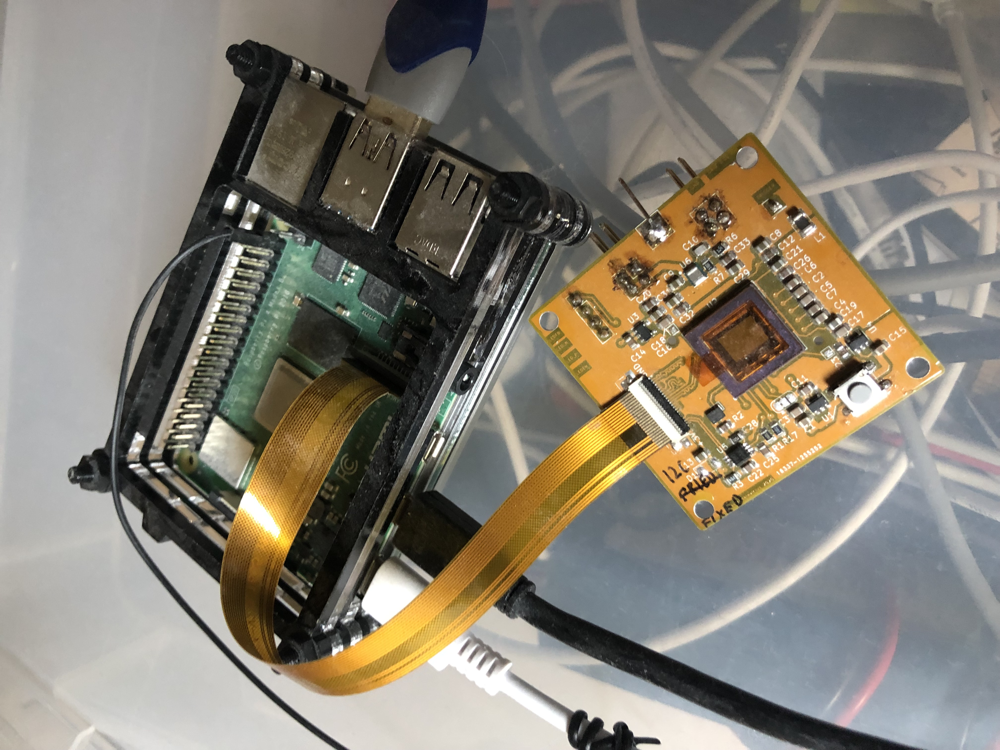

# melexis_VGA_ToF_camera
PCB design with the new MLX75027 VGA time of flight sensor

For test pattern acquisition it can be used with Raspberry Pi, for real operation it needs external power supply.

